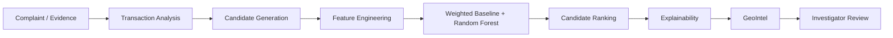

# SENTINEL

**Investigator decision-support for cybercrime cash-out prioritization**
SIH 2026 · Problem Statement 26184

[](https://frontend-five-silk-0p4v3i6q8p.vercel.app/)  

> [!NOTE]
> All data used by SENTINEL is synthetic. The system ranks plausible candidate cash-out locations for investigator prioritization based on evidence available at query time — it does **not** guarantee or confirm a future cash-out location.

SENTINEL is an **investigator decision-support system**, not an autonomous prediction system. It surfaces where an investigator should look first — it does not decide, and does not claim certainty.

## The Problem

**Problem Statement 26184:** *"Development of a Predictive Analytics Framework for Cybercrime Complaints to Forecast Likely Cash Withdrawal Locations in Advance, Enabling Generation of Actionable Intelligence for Timely and Proactive Cybercrime Intervention."*

When a cybercrime complaint is filed, the money trail often runs through a chain of mule accounts before cashing out. Investigators must decide where to focus limited resources — which locations are worth watching — based on a transaction trail, timing, and geography. Reasoning across all of these signals by hand, for every case, doesn't scale. SENTINEL assists that prioritization; it does not replace investigator judgment.

## What SENTINEL Does

Given a case, SENTINEL:

1. Loads the case's observed synthetic evidence — transaction chain, accounts, complaint metadata
2. Generates a set of **candidate cash-out locations** from that evidence alone (never from the hidden ground truth)
3. Derives **47 ranking features** across 5 signal groups for each candidate
4. **Ranks** the candidates using either an interpretable weighted baseline or a trained Random Forest
5. Produces a **human-readable explanation** for why each candidate was ranked where it was
6. Presents the case through an investigator-facing workspace, including a GIS map (**GeoIntel**)

Three distinctions the system is built to preserve throughout:

- **Candidate generation ≠ ranking** — candidates are proposed from evidence first, independent of any model
- **Ranking ≠ confirmation** — a rank is a priority order, not a prediction of what will happen
- **Prioritization ≠ certainty** — no probability, confidence score, or guarantee is presented anywhere in the system

## How It Works



1. **Complaint / Evidence** — a case's synthetic transaction chain and accounts are loaded
2. **Transaction Analysis** — the ledger is summarized (accounts, amounts, timing, sender/receiver metros)
3. **Candidate Generation** — candidate locations are drawn from the union of the complaint origin metro and all transaction sender/receiver metros (the "evidence metros"); ground truth is never used to select or filter candidates
4. **Feature Engineering** — 47 features are computed per candidate, using only data available before the complaint's analysis cutoff
5. **Ranking** — the weighted baseline and/or Random Forest score and order the candidates
6. **Explainability** — each ranked candidate carries a deterministic, evidence-grounded explanation
7. **GeoIntel** — candidates and observed evidence are plotted on a map, visually distinct from each other
8. **Investigator Review** — the investigator inspects evidence, timeline, network, candidates, and explanations before acting

## Investigation Workflow

The frontend is organized as a case workspace with one page per investigative concern:

```
Overview → Evidence (Transactions) → Timeline → Network → GeoIntel → Candidates → Report
```

- **Overview** — case snapshot, current top-ranked priority, links into each workspace
- **Evidence / Transactions** — the recorded transaction chain and accounts for the case (factual data, not ranking output)
- **Timeline** — chronological view of the case's transaction activity
- **Network** — relationships between accounts involved in the case
- **GeoIntel** — map view distinguishing observed evidence locations from SENTINEL-ranked candidates
- **Candidates** — the ranked candidate list, with model selection (baseline / Random Forest) and top-K control
- **Report** — case summary for investigator record-keeping

## Candidate Ranking

SENTINEL scores candidates with two models side by side, deliberately trading off interpretability against learned pattern-matching.

### Weighted Baseline

A transparent, hand-specified scoring function over five signal groups:

| Group | Weight | What it captures |
|---|---:|---|
| Geographic | 30% | Proximity to origin and transaction endpoints — the most interpretable signal |
| Transaction | 25% | Patterns in the pre-complaint transaction chain |
| Location | 15% | Characteristics of the candidate location itself |
| Temporal | 15% | Timing behavior (complaint delay, transaction velocity, inter-arrival) |
| Case | 15% | Case-level context, used mainly for disambiguation |

Every candidate's group-level scores are exposed by the API and shown in the UI — this model's reasoning is fully inspectable. (The group *weights* above live in `src/modeling/baseline.py`; they are not currently returned by the API, so the UI never displays or implies them.)

### Random Forest

A `RandomForestClassifier` (200 trees, balanced class weights, `random_state=42`) trained on the same 47 features, evaluated with a strict case-level train/test split so no case appears in both sets.

### Why Two Models?

The baseline exists as an interpretable reference point. The Random Forest exists to test whether a learned model improves ranking quality over that reference — while the baseline stays available as a transparent fallback. Neither model is treated as universally better; see **Evaluation** below for the honest, current result.

## Feature Engineering

47 candidate-level features, computed strictly from information available before each case's analysis cutoff (query-time cutoff enforcement — no post-complaint or ground-truth data ever reaches a feature). Features are grouped into the same five categories used by the weighted baseline (geographic, transaction, location, temporal, case), which keeps both models' reasoning organized around the same interpretable structure. Missing pre-complaint transaction data is encoded with an explicit sentinel value rather than silently imputed.

## Explainability

**Weighted Baseline** — the API returns per-group scores, the overall ranking score, and rank position for every candidate, so the UI can show exactly which signal groups drove a candidate's placement.

**Random Forest** — the API returns a supporting-evidence explanation string for each candidate; RF has no group scores, and the UI explicitly labels this "Not exposed" rather than showing a misleading zero.

What the system does **not** claim: no SHAP values, no feature-importance-per-prediction, no probability, no confidence score, and no causal explanation are exposed anywhere in the current API or UI. The "why prioritized" text shown to investigators is a deterministic summary of the actual ranking output — never a generated narrative.

## GeoIntel

The GeoIntel map distinguishes two categories of marker:

- **Solid markers** — observed evidence locations (from the actual transaction chain)
- **Hollow markers** — SENTINEL-ranked candidates

The map is explicit that a ranked location is a **priority for investigator review, not a confirmed cash-out location.** The map does not show ATM availability, crime density, travel time, or any live bank or NCRP data — it visualizes the same ranking output available elsewhere in the case workspace.

## Synthetic Dataset

| | |
|---|---:|
| Cases | 5,000 (dataset v0.2.0, seed 42) |
| Accounts | 20,653 |
| Transactions | 15,653 |
| Candidate locations | 385 (47 metros, 21 states/UTs) |
| Features per candidate | 47 |

Generation is deterministic and reproducible (seeded RNG — regenerating the dataset produces byte-identical output). Metro/location sampling is tier-weighted across 47 Indian city metros; complaints are spread across a 365-day window with a lognormal (clipped) amount distribution; 7 fraud scenario types drive behavioral parameters for transaction chains. All data — accounts, transactions, candidate locations, and ground truth — is synthetic; there is no real NCRP, banking, or personally identifiable data anywhere in the repository.

## ML Integrity & Leakage Controls

This is one of the project's strongest technical properties, so it gets its own section rather than a bullet buried in a changelog:

- **Query-time cutoff enforcement** — every feature is computed only from data that would have been available before a case's complaint analysis point; no post-complaint or future information reaches the model
- **Ground-truth-independent candidate generation** — the true cash-out location is never force-inserted into, or used to select, the candidate set
- **Case-level train/test split** — no case appears in both the training and test sets, for either model
- **Leakage auditing** — an automated dataset audit (`scripts/dataset_stats.py`) checks for duplicates, leakage, and analysis-point boundary violations

## Evaluation

All results below are **offline evaluation on the synthetic test set (60 cases)** — they describe relative model behavior on this dataset, not real-world deployment performance.

| Metric | Weighted Baseline | Random Forest | Winner |
|---|---:|---:|---|
| Top-1 Accuracy | 8.3% | 8.3% | Tie |
| Top-3 Accuracy | 20.0% | 26.7% | RF |
| Top-5 Accuracy | 31.7% | 31.7% | Tie |
| MRR | 0.2254 | 0.2362 | RF |
| Mean Rank ↓ | 8.12 | 8.07 | RF |
| Median Rank ↓ | 9.0 | 9.0 | Tie |

**Current result: Random Forest wins 3/6 metrics; Weighted Baseline wins 3/6.** RF's edge is concentrated in specific scenario types (`MULTI_HOP`, `RAPID_MULE_CHAIN`, `GEOGRAPHIC_JUMP`), while the baseline holds a clear advantage on others (`DIRECT_CASHOUT`, `URBAN_CLUSTER`, `DELAYED_CASHOUT`, `DISPERSED_ACTIVITY`) — see `docs/PROJECT_STATUS.md` for the full per-scenario breakdown. Neither model dominates; this is the honest, current picture.

These numbers reflect the current **evidence-based, ground-truth-independent** candidate generation pipeline. An earlier development-stage pipeline (which force-inserted the true location into every candidate set) produced higher, less representative numbers — those are retained only as historical development notes in `docs/PROJECT_STATUS.md` and are **not** the current system's behavior.

### Candidate Coverage

Because candidates are generated strictly from observable evidence (never from ground truth), the true location isn't always in the candidate set at all: it appears in 28.3% of the 5,000 cases (average 11.38 candidates per case). This is expected, leakage-free behavior — coverage is an *outcome* of evidence-only generation, not a guarantee the generator engineers in.

## Limitations & Responsible Scope

- All data is **synthetic** — there is no live NCRP integration and no live bank transaction access
- SENTINEL provides **no guarantee** that a ranked location corresponds to any future cash-out event
- Candidate ranking is **prioritization for investigator attention**, not a prediction
- A ranked location is **not a confirmed cash-out location**
- The system is **investigator decision support** — it does not make, and is not designed to make, autonomous law-enforcement decisions
- Candidate coverage (28.3%) means the true location is often outside the candidate set entirely on this dataset — the system's usefulness is bounded by the evidence available at query time

## SIH 2026 Alignment

| Problem statement requirement | SENTINEL capability |
|---|---|
| Analyze cybercrime complaint data | Synthetic complaint + transaction evidence pipeline with 47-feature extraction |
| Forecast likely cash withdrawal locations | Evidence-based candidate generation + ranking (explicitly scoped as prioritization, not forecasting with certainty) |
| Generate actionable intelligence | Ranked, explained candidate list with per-group reasoning (baseline) and supporting-evidence text (RF) |
| Enable timely, proactive intervention | Investigator-facing case workspace: evidence → timeline → network → GeoIntel → candidates → report |

## Tech Stack

**Frontend** — Next.js 14, React 18, TypeScript, Tailwind CSS, Leaflet (GIS)
**Backend** — FastAPI, Pydantic
**Data & Modeling** — Python 3.12, scikit-learn 1.9 (Random Forest), NumPy-based weighted baseline
**Testing** — pytest, httpx (241 tests: data generation, features, leakage, API, RF explanation honesty)

## Demo

A live deployment is available: **[frontend-five-silk-0p4v3i6q8p.vercel.app](https://frontend-five-silk-0p4v3i6q8p.vercel.app/)**

<!-- TODO: Add screenshots of the investigator workflow here. No screenshot assets currently exist in the repository. Recommended sequence once captured: Overview → Evidence/Transactions → Timeline → Network → GeoIntel → Candidates → Explainability panel → Report. -->

<details>
<summary>Project Structure</summary>

```
SENTINEL/
├── backend/app/          # FastAPI backend (routes, services, schemas)
├── frontend/src/app/     # Next.js case workspace (9 routes, 7 case surfaces)
├── src/data_generation/  # Synthetic data generator + feature engineering
├── src/modeling/         # Weighted baseline, Random Forest, evaluation
├── data/generated/       # Model-visible synthetic data (.jsonl)
├── data/evaluation/      # Hidden ground truth (.jsonl)
├── scripts/              # Data generation, evaluation, dataset audit CLIs
├── tests/                # 241 tests
├── docs/                 # Architecture, feature contract, leakage policy, project status
└── pyproject.toml
```

</details>

## Getting Started

### Prerequisites

Python 3.12, Node.js (for the frontend)

### Installation

```bash
pip install -e ".[dev]"
```

### Generate the Synthetic Dataset

```bash
python scripts/generate_data.py           # default seed
python scripts/generate_data.py --seed 123 # custom seed
```

### Run the Backend

```bash
uvicorn backend.app.main:app --reload
# API docs: http://localhost:8000/docs
```

### Run the Frontend

```bash
cd frontend
npm install
npm run dev
```

### Want to Explore Without Running It Locally?

Use the [live demo](https://frontend-five-silk-0p4v3i6q8p.vercel.app/) instead.

## Testing

```bash
pytest -q                                              # all 241 tests
pytest tests/test_features.py -v                       # feature engineering
pytest tests/test_leakage.py tests/test_audit_regression.py -v   # leakage controls
pytest tests/test_rf_explanation_honesty.py -v          # RF explanation claims
```

Coverage spans synthetic data generation, feature engineering, leakage/temporal-boundary enforcement, both ranking models, the API layer, and explanation-honesty checks (verifying the UI never claims more than the models actually expose).

## Documentation

- [docs/MVP_ARCHITECTURE.md](docs/MVP_ARCHITECTURE.md) — architecture overview
- [docs/FEATURE_CONTRACT.md](docs/FEATURE_CONTRACT.md) — feature specification
- [docs/SYNTHETIC_DATA_SPEC.md](docs/SYNTHETIC_DATA_SPEC.md) — data specification
- [docs/DATA_LEAKAGE_POLICY.md](docs/DATA_LEAKAGE_POLICY.md) — three-layer leakage contract (Layer A/B/C)
- [docs/PROJECT_STATUS.md](docs/PROJECT_STATUS.md) — full phase history and current metrics
- [docs/DEVELOPMENT_WORKFLOW.md](docs/DEVELOPMENT_WORKFLOW.md) — team workflow
- [CONTRIBUTING.md](CONTRIBUTING.md) — contribution guidelines

<details>
<summary>Development History</summary>

- **Phase 1 — Data Foundation** — synthetic schema, geographic generator, 7 fraud scenarios, leakage detection, seeded reproducibility (40 tests)
- **Phase 2 — Feature Engineering** — 47 candidate-level features, query-time cutoff enforcement, leakage-classified feature registry (73 tests)
- **Phase 3 — Weighted Risk Baseline** — 5-group interpretable scoring, ranking evaluation metrics, human-readable explanations (114 tests)
- **Phase 4 — Random Forest** — case-level split enforcement, full ranking evaluation, feature importance (147 tests)
- **Phase 6 — FastAPI Backend** — 4 endpoints, service-layer separation, investigator-decision-support language throughout (181 tests)
- **Phase 7 — Frontend Dashboard** — Next.js case workspace, Leaflet GIS map, bidirectional candidate/map highlight sync
- **Phase 10 — Dataset Scale & Diversity** — expanded to 47 metros / 21 states/UTs, 5,000 cases, ground-truth-independent candidate generation, dataset audit script (241 tests)

Full detail: [docs/PROJECT_STATUS.md](docs/PROJECT_STATUS.md)

</details>

## License

[MIT License](LICENSE) — SIH 2026 Hackathon, Copyright (c) 2026 SENTINEL Team.
